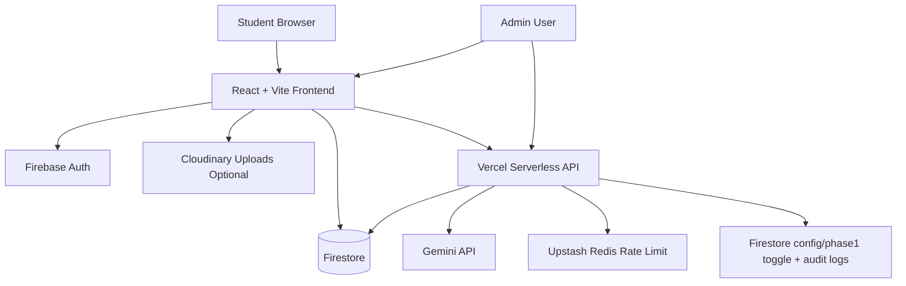

# Document Cloud Architecture

## Context
This document explains the architecture of a real cloud-hosted student platform: **TheCampusHelper**.

TheCampusHelper supports SNIST students through:
- learning resources (PPT, MID papers, PYQ, important questions),
- collaboration (study groups, chat, shared notes),
- academic tools (CGPA calculator, compiler),
- AI-assisted study features.

The design goal is straightforward: **ship quickly, run at zero cost using free tiers, and protect user data and private API keys**.

## Architecture at a Glance
- Product type: Full-stack student platform
- Frontend: React + Vite
- Authentication: Firebase Auth
- Database: Firestore
- Backend: Vercel Serverless Functions
- AI: Gemini (server-side proxy)
- Rate limiting: Upstash Redis
- Optional uploads: Cloudinary (fallback path)

## Scope and Objective
The objective of this architecture is to deliver a reliable student platform with:
- secure authentication,
- role-based access control,
- low-latency data access,
- safe AI integration,
- and an operational model a student team can maintain long-term.

## High-Level Architecture

## Components in Simple Terms
1. Frontend (React + Vite)
  - Student-facing UI for resources, collaboration, and tools.
  - Uses Firebase SDK for login and allowed reads/writes.

2. Authentication (Firebase Auth)
  - Identifies user securely.
  - User token is attached to protected serverless API calls.

3. Database (Firestore)
  - Stores resources, study groups, messages, and metadata.
  - Protected by `firestore.rules`, token checks, and role logic.

4. Serverless backend (`api/` on Vercel)
  - Handles sensitive actions and AI requests.
  - Hides private keys from the browser.
  - Hosts admin-only operations (for example, runtime toggle endpoints and audit-aware controls).

5. AI integration (Gemini via proxy)
  - Browser never calls Gemini directly.
  - Client calls serverless endpoint, server calls Gemini.

6. Rate limiting (Upstash Redis)
  - Protects AI endpoints from abuse.
  - Example from project behavior: per-user/per-IP limits.

7. Optional file upload path (Cloudinary)
  - Used when Firebase Storage billing is not enabled.
  - Supports allowed formats like PDF/PPTX.

## End-to-End Request Flow (AI Study Assistant)
1. Student logs in with Firebase Auth.
2. Frontend sends request to `/api/study-assistant` with auth token.
3. Serverless function verifies token using Firebase Admin SDK.
4. Server checks Redis rate limit.
5. If allowed, server calls Gemini API with server-side key.
6. Server returns response to frontend.
7. Frontend renders answer and keeps recent context for better UX.

Why this flow matters:
- It prevents direct client access to private AI keys.
- It gives the platform one controlled point for rate limiting and request policy.

## End-to-End Request Flow (Admin Runtime Control)
1. Admin signs in and receives a valid Firebase ID token.
2. Admin calls `POST /api/admin/setPhase1Toggle`.
3. Server verifies role (`admin` or `super_admin`).
4. Server updates the `serverlessOnly` field in the `config/phase1` document atomically.
5. Server writes an audit-style event with actor, before/after state, and reason.
6. Client and Firestore rules read the same toggle, enabling one-switch rollback.

Why this flow matters:
- It provides safe rollout control during active development.
- It reduces production risk by making rollback explicit and fast.

## End-to-End Request Flow (Resource Management)
1. Admin uploads resource metadata (branch, semester, subject, type).
2. Client writes/requests data according to Firestore rules.
3. Resource categories are normalized to system-defined values.
4. Students query by branch + semester to get clean filtered results.

Why this flow matters:
- It keeps data consistently organized across semesters and branches.
- It improves discoverability and reduces duplicate or noisy uploads.

## Security Design
1. Secret isolation
  - Sensitive keys (Gemini, Admin SDK, Redis) exist only on server side.
  - Any variable with a `VITE_` prefix is exposed to the client bundle, so only non-secret configuration values should use this prefix.

2. Access control
  - Firebase roles + Firestore rules gate privileged paths.
  - Admin endpoints require verified token and role.

3. Defense against abuse
  - Rate limiting on AI endpoints.
  - Strict endpoint-level validation for payloads and roles.

4. Safe rollout control
  - The `serverlessOnly` field in the `config/phase1` document enables controlled migration.
  - The same toggle is read by both rules and app logic for one-switch rollback.

5. Auditability
  - Admin toggle endpoint records actor and before/after metadata.

6. Rule hygiene
  - Firestore rules are the final gate for **client SDK** access.
  - Server-side code that uses the Firebase Admin SDK bypasses rules, so serverless endpoints must enforce authorization and validation in application code.
  - Sensitive mutation paths are intentionally shifted to serverless endpoints.

Security outcome:
- Secrets stay server-side.
- Privileged actions are traceable.
- Abuse surface is reduced through layered controls.

## Scalability and Reliability
1. Stateless compute
  - Vercel serverless functions scale with traffic automatically.

2. Real-time data model
  - Firestore supports low-latency updates for chat and collaboration.

3. Controlled schema evolution
  - Migration scripts normalize old data without data loss.

4. Degraded-mode resilience
  - Frontend can still run if specific API features are unavailable.
  - Serverless-only mode can be enabled for safer operation.

5. Hotspot control
  - Rate limiting and server-side validation reduce load spikes on AI-heavy routes.

Reliability outcome:
- The platform can scale incrementally without redesigning core architecture.
- Production incidents are easier to isolate because responsibilities are separated.

## Cost Strategy (Student Friendly)
1. TheCampusHelper is currently deployed at **zero infrastructure cost** using free tiers.
2. Vercel + Firebase free-tier baseline supports current usage.
3. Cloudinary is used as an optional fallback path when needed.
4. Upstash free tier handles lightweight rate limiting.
5. Architecture supports incremental upgrades only when traffic grows beyond free-tier limits.

Cost outcome:
- The platform stays financially accessible for students while maintaining production-grade practices.

## Tradeoffs
1. Serverless reduces ops burden but can have cold starts.
2. Firestore is fast for product iteration but needs careful rules and index design.
3. Real-time features improve UX but require strict moderation and data hygiene.
4. AI proxy design is safer than direct browser calls but adds backend complexity.

## Architecture Decisions (Why These Choices)
1. Vercel serverless over a long-running server:
  - Faster deployment and lower operational effort for a student team.

2. Firestore over self-managed SQL:
  - Easier real-time collaboration and simpler maintenance at early scale.

3. Gemini via server proxy over direct client calls:
  - Strong key protection and better control over usage limits.

4. Feature toggle for runtime migration:
  - Safer rollout and rollback during active development.

## Risks and Mitigations
1. Risk: serverless cold starts may affect perceived latency.
  - Mitigation: keep endpoints lightweight and separate heavy paths.

2. Risk: Firestore rule misconfiguration can overexpose data.
  - Mitigation: enforce rule reviews and role-based integration tests.

3. Risk: AI endpoint misuse can increase cost quickly.
  - Mitigation: per-user/per-IP rate limits and stricter request validation.

4. Risk: rapid schema changes may break old clients.
  - Mitigation: migration scripts and staged rollout using runtime toggles.

## Why this Architecture is Strong
- It is a real deployed student system, not a hypothetical template.
- It balances speed, security, and cost in a practical way.
- It demonstrates clear engineering decisions:
  - secret management,
  - RBAC,
  - rate limiting,
  - rollback-safe architecture.
- It is realistic for campus operations, where maintainability matters as much as features.

## Conclusion
This architecture is practical, secure, and maintainable for a student-led platform.
It balances delivery speed with responsible engineering controls, and it can evolve in phases without high migration risk.
At its current scale, TheCampusHelper runs fully on free-tier services with zero infrastructure spend.

## What I’d Improve With More Time
1. Add OpenTelemetry-style tracing for API and Firestore operations.
2. Add dead-letter/retry strategy for failed async workflows.
3. Add stronger admin analytics dashboard with usage and moderation insights.
4. Add threat model documentation and periodic security review checklist.
